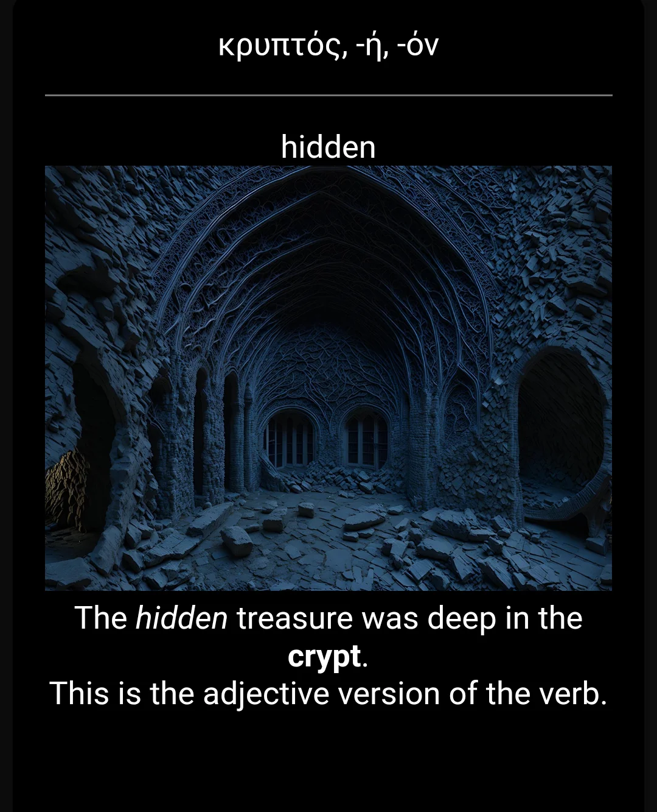

# Keep Greek and Hebrew for Life!

Ready to make your memory of Greek and Hebrew a choice instead of leaving it up to chance? These flashcards, when done every day, will keep your load light and easy (without overwhelm) so that you can learn and retain your knowledge of God's word for the rest of your life. You'll get to "keep it all forever"!

These flashcard packs include the alphabet, vocab words, and grammar. Virtually every one of the vocab words in the Greek and Hebrew packs has an image and mnemonic device along with it to greatly aid in your memory.

Go ahead and read the "Start Here!.pdf" file to get going!

Many more grammar packs are in the works. Each time an update is completed, the updated pack should show up here on this page. If anyone finds issues with the pack, please leave a comment below and I will fix it as soon as I can.

# How to Download the Flashcards

*To download them, simply click on each pack you'd like to have, and then click the download button.*

**The best way to download it all in one go is to click [here](Zip_File_Containing_All_Flashcard_Packs) to see the zip file containing everything, then click the title of the zip file, and finally, click the download button right next to the word "raw."**

### Example of one of the flashcards:

